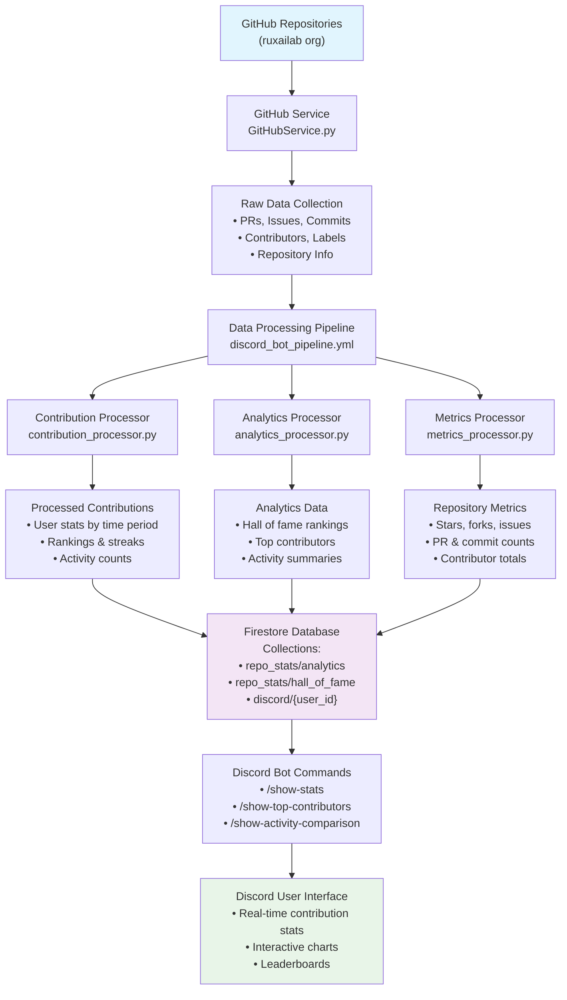
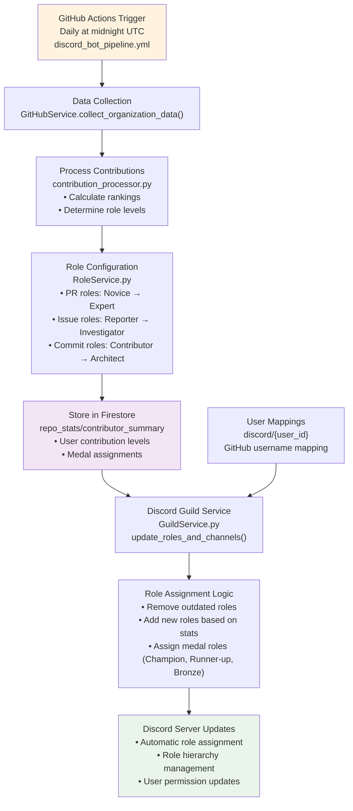
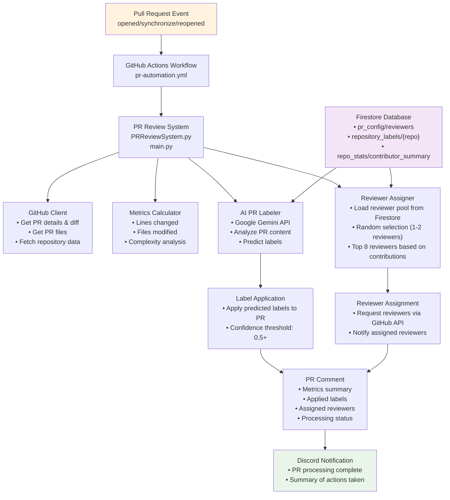
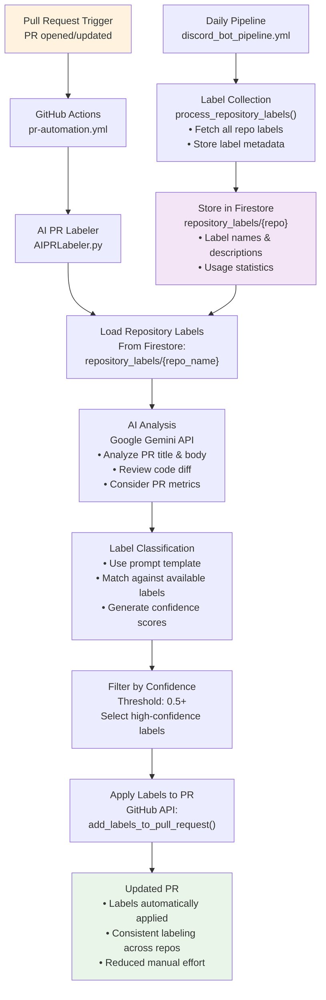
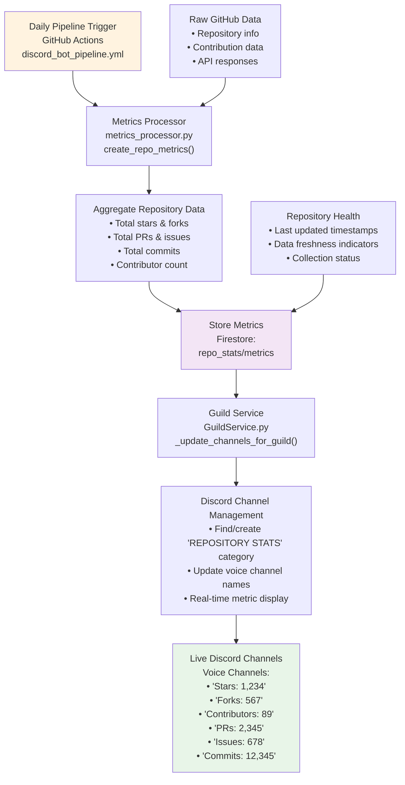
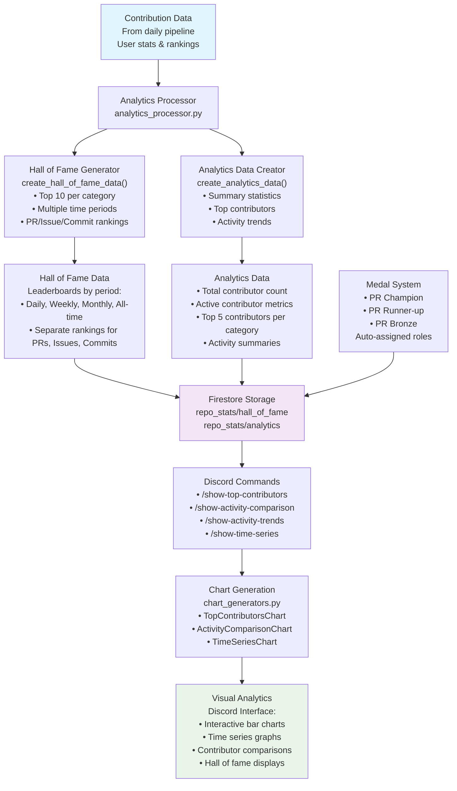

# GSoC 2025
> For deploying the Discord bot on your own server, refer to the [Discord Bot Setup Guide](discord_bot/README.md).

**Repository:** [disgitbot](https://github.com/ruxailab/disgitbot)

**Try the bot:** [RUXAILAB Discord Server](https://discord.gg/VAxzZxVV)

**Student:** Tianqin Meng  
**GitHub:** [@tqmsh](https://github.com/tqmsh)

**Organization:** Uramaki LAB

**Project:** [Integration of GitHub Actions with Discord Role Management](https://summerofcode.withgoogle.com/programs/2025/projects/gZbjuWuX)  
**Inspired by:** [ideas2025](https://github.com/ruxailab/gsoc/blob/main/ideas2025.md)

---

## Project Overview

The Disgitbot project aims to create a comprehensive Discord bot that integrates GitHub activity with Discord communities, providing real-time notifications, contribution analytics, and automated workflow management. The project focuses on enhancing community engagement and streamlining development workflows through intelligent automation.

---

## Timeline & Tasks

| Status     | Task                                             | Week      | Timeline           | Issue / Report Link                                                                                 | Images                | Implementation Diagram |
|------------|--------------------------------------------------|-----------|--------------------|-----------------------------------------------------------------------------------------------------|----------------------|------------------------|
| Completed  | Discord Bot for Real-Time GitHub Contribution Stats | 1-2       | May 27 - June 9, 2025     | [Issue #2](https://github.com/ruxailab/disgitbot/issues/2)                                          | [Discord Command](#image-1-discord-command) • [Data Pipeline](#image-2-data-collection) • [GitHub Actions](#image-3-github-actions) • [Raw Data](#image-4-raw-github-data) • [Data Processing](#image-5-data-processing) • [Data Storage](#image-6-data-storage) • [GitHub OAuth](#image-7-github-oauth) • [Cloud Logs](#image-8-cloud-logs) | [Data Pipeline Architecture](#diagram-1-contribution-stats-pipeline) |
| Completed  | Discord Role Auto-Update Bot                     | 3-4       | June 10 - June 23, 2025    | [Issue #9](https://github.com/ruxailab/disgitbot/issues/9)                                          | [Auto Role Update](#image-9-auto-role-update) • [Role Assignment](#image-10-role-assignment) | [Role Update Workflow](#diagram-2-role-update-system) |
| Completed  | AI-Assisted Pull Request Review Integration       | 5-7       | June 24 - July 14, 2025 | [Issue #3](https://github.com/ruxailab/disgitbot/issues/3)                                          | [PR Review](#image-11-pr-review) | [PR Review Automation](#diagram-3-pr-review-integration) |
| Completed  | Automatic Labelling for PRs Using PR Labeller    | 8         | July 15 - July 21, 2025   | [Issue #4](https://github.com/ruxailab/disgitbot/issues/4)                                          | [PR Labeller](#image-12-pr-labeller) | [AI Labeling System](#diagram-4-pr-labeling-workflow) |
| Completed  | Research Metric Tracking and Channel Creation     | 9-10      | July 22 - August 4, 2025 | [Issue #8](https://github.com/ruxailab/disgitbot/issues/8)                                          | [Metric Tracking](#image-15-metric-tracking) | [Metrics & Channels](#diagram-5-metrics-tracking-system) |
| Completed  | Contributor Analytics and Hall of Fame Visualization | 11-12        | July 29 - August 11, 2025 | [Issue #6](https://github.com/ruxailab/disgitbot/issues/6)                                          | [Analytics](#image-13-analytics) • [Hall of Fame](#image-14-hall-of-fame) | [Analytics & Visualization](#diagram-6-analytics-hall-of-fame) |

---

## Gallery

<h4>Image 1: Discord Command</h4>

<h4>Image 2: Data Collection Pipeline</h4>

<h4>Image 3: GitHub Actions Process</h4>

<h4>Image 4: Raw GitHub Data</h4>

<h4>Image 5: Data Processing</h4>

<h4>Image 6: Data Storage</h4>

<h4>Image 7: GitHub OAuth on Discord</h4>

<h4>Image 8: OAuth Cloud Logs</h4>

<h4>Image 9: Auto Role Update</h4>

<h4>Image 10: Role Assignment</h4>

<h4>Image 11: PR Review</h4>

<h4>Image 12: PR Labeller</h4>

<h4>Image 13: Analytics</h4>

<h4>Image 14: Hall of Fame</h4>

<h4>Image 15: Metric Tracking</h4>

---

## Implementation Diagrams

<h4>Diagram 1: Discord Bot for Real-Time GitHub Contribution Stats - Data Pipeline Architecture</h4>

<h4>Diagram 2: Discord Role Auto-Update Bot - Role Update Workflow</h4>

<h4>Diagram 3: AI-Assisted Pull Request Review Integration - PR Review Automation</h4>

<h4>Diagram 4: Automatic Labelling for PRs Using PR Labeller - AI Labeling System</h4>

<h4>Diagram 5: Research Metric Tracking and Channel Creation - Metrics & Channels</h4>

<h4>Diagram 6: Contributor Analytics and Hall of Fame Visualization - Analytics & Visualization</h4>

---

For more details, see the [project documentation](https://github.com/ruxailab/gsoc/blob/main/ideas2025.md).
