# Building Disgitbot: A Discord Bot That Bridges GitHub and Community

*How we built an intelligent Discord bot that automatically tracks contributions, assigns roles, and manages pull requests using AI*

## The Vision

Picture this: you're in a Discord server where your role automatically updates based on your GitHub contributions. When you open a pull request, it gets intelligent labels and reviewers assigned by AI. You can see real-time analytics of your team's development activity right in Discord.

That's exactly what we built with Disgitbot.

*The bot responds to user commands with real-time GitHub contribution data*

## What We Built

Disgitbot is a comprehensive Discord bot that integrates GitHub activity with Discord communities. It's not just another bot—it's a complete workflow automation system that handles everything from contribution tracking to AI-powered code review.

The project was completed as part of Google Summer of Code 2025, working with Uramaki LAB to create something that would actually make developers' lives easier.

*The complete data collection and processing pipeline*

## The Core Architecture

At its heart, Disgitbot runs on a clean, modular architecture. We built it using dependency injection, design patterns, and single responsibility principles. Each component has one clear job, making the system easy to test, maintain, and extend.

The bot connects to GitHub's API, processes the data through a custom pipeline, stores everything in Firestore, and then updates Discord automatically. It's like having a personal assistant that never sleeps.

*GitHub Actions workflow that powers the entire system*

## Six Major Features, One Bot

### 1. Real-Time Contribution Tracking

The bot collects data from all your GitHub repositories—every pull request, issue, and commit. It processes this information to calculate rankings, streaks, and activity patterns.

```mermaid
graph TD
    A["GitHub Repositories<br/>(ruxailab org)"] --> B["GitHub Service<br/>GitHubService.py"]
    B --> C["Raw Data Collection<br/>• PRs, Issues, Commits<br/>• Contributors, Labels<br/>• Repository Info"]
    
    C --> D["Data Processing Pipeline<br/>discord_bot_pipeline.yml"]
    D --> E["Contribution Processor<br/>contribution_processor.py"]
    D --> F["Analytics Processor<br/>analytics_processor.py"]
    D --> G["Metrics Processor<br/>metrics_processor.py"]
    
    E --> H["Processed Contributions<br/>• User stats by time period<br/>• Rankings & streaks<br/>• Activity counts"]
    F --> I["Analytics Data<br/>• Hall of fame rankings<br/>• Top contributors<br/>• Activity summaries"]
    G --> J["Repository Metrics<br/>• Stars, forks, issues<br/>• PR & commit counts<br/>• Contributor totals"]
    
    H --> K["Firestore Database<br/>Collections:<br/>• repo_stats/analytics<br/>• repo_stats/hall_of_fame<br/>• discord/{user_id}"]
    I --> K
    J --> K
    
    K --> L["Discord Bot Commands<br/>• /show-stats<br/>• /show-top-contributors<br/>• /show-activity-comparison"]
    
    L --> M["Discord User Interface<br/>• Real-time contribution stats<br/>• Interactive charts<br/>• Leaderboards"]
    
    style A fill:#e1f5fe
    style K fill:#f3e5f5
    style M fill:#e8f5e8
```

Users can run commands like `/show-stats` to see their current contribution levels, or `/show-top-contributors` to view leaderboards. The data updates daily through GitHub Actions, so everything stays current.

### 2. Automatic Role Management

This is where it gets interesting. The bot automatically assigns Discord roles based on contribution levels. Make your first pull request? You get the "🌸 1+ PRs" role. Reach 51+ PRs? You become a "🌹 51+ PRs" contributor.

The system runs every night, recalculating everyone's contributions and updating their roles accordingly. It even assigns special medal roles to the top three contributors.

*Automatic role assignment based on GitHub contributions*

```mermaid
graph TD
    A["GitHub Actions Trigger<br/>Daily at midnight UTC<br/>discord_bot_pipeline.yml"] --> B["Data Collection<br/>GitHubService.collect_organization_data()"]
    
    B --> C["Process Contributions<br/>contribution_processor.py<br/>• Calculate rankings<br/>• Determine role levels"]
    
    C --> D["Role Configuration<br/>RoleService.py<br/>• PR roles: Novice → Expert<br/>• Issue roles: Reporter → Investigator<br/>• Commit roles: Contributor → Architect"]
    
    D --> E["Store in Firestore<br/>repo_stats/contributor_summary<br/>• User contribution levels<br/>• Medal assignments"]
    
    E --> F["Discord Guild Service<br/>GuildService.py<br/>update_roles_and_channels()"]
    
    F --> G["Role Assignment Logic<br/>• Remove outdated roles<br/>• Add new roles based on stats<br/>• Assign medal roles (Champion, Runner-up, Bronze)"]
    
    G --> H["Discord Server Updates<br/>• Automatic role assignment<br/>• Role hierarchy management<br/>• User permission updates"]
    
    I["User Mappings<br/>discord/{user_id}<br/>GitHub username mapping"] --> F
    
    style A fill:#fff3e0
    style E fill:#f3e5f5
    style H fill:#e8f5e8
```

### 3. AI-Powered Pull Request Review

When someone opens a pull request, the bot automatically analyzes it using Google's Gemini AI. It examines the code changes, predicts appropriate labels, and assigns reviewers from a pool of top contributors.

The AI looks at the PR title, description, and code diff to understand what the change does. It then matches this against the repository's available labels and assigns them with confidence scores.

*AI-powered PR review and automation*

```mermaid
graph TD
    A["Pull Request Event<br/>opened/synchronize/reopened"] --> B["GitHub Actions Workflow<br/>pr-automation.yml"]
    
    B --> C["PR Review System<br/>PRReviewSystem.py<br/>main.py"]
    
    C --> D["GitHub Client<br/>• Get PR details & diff<br/>• Get PR files<br/>• Fetch repository data"]
    
    C --> E["Metrics Calculator<br/>• Lines changed<br/>• Files modified<br/>• Complexity analysis"]
    
    C --> F["AI PR Labeler<br/>• Google Gemini API<br/>• Analyze PR content<br/>• Predict labels"]
    
    C --> G["Reviewer Assigner<br/>• Load reviewer pool from Firestore<br/>• Random selection (1-2 reviewers)<br/>• Top 8 reviewers based on contributions"]
    
    H["Firestore Database<br/>• pr_config/reviewers<br/>• repository_labels/{repo}<br/>• repo_stats/contributor_summary"] --> G
    H --> F
    
    F --> I["Label Application<br/>• Apply predicted labels to PR<br/>• Confidence threshold: 0.5+"]
    G --> J["Reviewer Assignment<br/>• Request reviewers via GitHub API<br/>• Notify assigned reviewers"]
    
    I --> K["PR Comment<br/>• Metrics summary<br/>• Applied labels<br/>• Assigned reviewers<br/>• Processing status"]
    J --> K
    
    K --> L["Discord Notification<br/>• PR processing complete<br/>• Summary of actions taken"]
    
    style A fill:#fff3e0
    style H fill:#f3e5f5
    style L fill:#e8f5e8
```

### 4. Intelligent Labeling System

The bot doesn't just guess at labels—it learns from your repository's existing label structure. It collects all available labels during the daily pipeline run and stores them in Firestore. When a PR comes in, the AI analyzes the content and matches it against these known labels.

This ensures consistency across your entire organization. No more manually applying labels or forgetting to categorize PRs properly.

*AI-powered automatic label assignment*

```mermaid
graph TD
    A["Pull Request Trigger<br/>PR opened/updated"] --> B["GitHub Actions<br/>pr-automation.yml"]
    
    B --> C["AI PR Labeler<br/>AIPRLabeler.py"]
    
    C --> D["Load Repository Labels<br/>From Firestore:<br/>repository_labels/{repo_name}"]
    
    D --> E["AI Analysis<br/>Google Gemini API<br/>• Analyze PR title & body<br/>• Review code diff<br/>• Consider PR metrics"]
    
    E --> F["Label Classification<br/>• Use prompt template<br/>• Match against available labels<br/>• Generate confidence scores"]
    
    F --> G["Filter by Confidence<br/>Threshold: 0.5+<br/>Select high-confidence labels"]
    
    G --> H["Apply Labels to PR<br/>GitHub API:<br/>add_labels_to_pull_request()"]
    
    I["Daily Pipeline<br/>discord_bot_pipeline.yml"] --> J["Label Collection<br/>process_repository_labels()<br/>• Fetch all repo labels<br/>• Store label metadata"]
    
    J --> K["Store in Firestore<br/>repository_labels/{repo}<br/>• Label names & descriptions<br/>• Usage statistics"]
    
    K --> D
    
    H --> L["Updated PR<br/>• Labels automatically applied<br/>• Consistent labeling across repos<br/>• Reduced manual effort"]
    
    style A fill:#fff3e0
    style K fill:#f3e5f5
    style L fill:#e8f5e8
```

### 5. Live Repository Metrics

The bot creates and updates Discord voice channels with real-time repository statistics. You'll see channels like "Stars: 1,234", "Forks: 567", and "Contributors: 89" that update automatically.

These metrics are aggregated from all your repositories, giving you a bird's-eye view of your organization's GitHub activity.

*Real-time repository metrics displayed in Discord*

```mermaid
graph TD
    A["Daily Pipeline Trigger<br/>GitHub Actions<br/>discord_bot_pipeline.yml"] --> B["Metrics Processor<br/>metrics_processor.py<br/>create_repo_metrics()"]
    
    B --> C["Aggregate Repository Data<br/>• Total stars & forks<br/>• Total PRs & issues<br/>• Total commits<br/>• Contributor count"]
    
    C --> D["Store Metrics<br/>Firestore:<br/>repo_stats/metrics"]
    
    D --> E["Guild Service<br/>GuildService.py<br/>_update_channels_for_guild()"]
    
    E --> F["Discord Channel Management<br/>• Find/create 'REPOSITORY STATS' category<br/>• Update voice channel names<br/>• Real-time metric display"]
    
    F --> G["Live Discord Channels<br/>Voice Channels:<br/>• 'Stars: 1,234'<br/>• 'Forks: 567'<br/>• 'Contributors: 89'<br/>• 'PRs: 2,345'<br/>• 'Issues: 678'<br/>• 'Commits: 12,345'"]
    
    H["Raw GitHub Data<br/>• Repository info<br/>• Contribution data<br/>• API responses"] --> B
    
    I["Repository Health<br/>• Last updated timestamps<br/>• Data freshness indicators<br/>• Collection status"] --> D
    
    style A fill:#fff3e0
    style D fill:#f3e5f5
    style G fill:#e8f5e8
```

### 6. Analytics and Hall of Fame

The bot generates beautiful charts and leaderboards showing contributor activity over time. Users can view top contributors by different metrics, see activity trends, and compare performance across the team.

The hall of fame system tracks leaders in multiple categories (PRs, issues, commits) across different time periods (daily, weekly, monthly, all-time).

*Interactive analytics and contributor insights*

*Top contributors leaderboard*

```mermaid
graph TD
    A["Contribution Data<br/>From daily pipeline<br/>User stats & rankings"] --> B["Analytics Processor<br/>analytics_processor.py"]
    
    B --> C["Hall of Fame Generator<br/>create_hall_of_fame_data()<br/>• Top 10 per category<br/>• Multiple time periods<br/>• PR/Issue/Commit rankings"]
    
    B --> D["Analytics Data Creator<br/>create_analytics_data()<br/>• Summary statistics<br/>• Top contributors<br/>• Activity trends"]
    
    C --> E["Hall of Fame Data<br/>Leaderboards by period:<br/>• Daily, Weekly, Monthly, All-time<br/>• Separate rankings for PRs, Issues, Commits"]
    
    D --> F["Analytics Data<br/>• Total contributor count<br/>• Active contributor metrics<br/>• Top 5 contributors per category<br/>• Activity summaries"]
    
    E --> G["Firestore Storage<br/>repo_stats/hall_of_fame<br/>repo_stats/analytics"]
    F --> G
    
    G --> H["Discord Commands<br/>• /show-top-contributors<br/>• /show-activity-comparison<br/>• /show-activity-trends<br/>• /show-time-series"]
    
    H --> I["Chart Generation<br/>chart_generators.py<br/>• TopContributorsChart<br/>• ActivityComparisonChart<br/>• TimeSeriesChart"]
    
    I --> J["Visual Analytics<br/>Discord Interface:<br/>• Interactive bar charts<br/>• Time series graphs<br/>• Contributor comparisons<br/>• Hall of fame displays"]
    
    K["Medal System<br/>• PR Champion<br/>• PR Runner-up<br/>• PR Bronze<br/>Auto-assigned roles"] --> G
    
    style A fill:#e1f5fe
    style G fill:#f3e5f5
    style J fill:#e8f5e8
```

## Technical Implementation

### The Data Pipeline

Everything runs through a daily GitHub Actions workflow that:
1. Collects raw data from GitHub's API
2. Processes contributions and calculates metrics
3. Stores everything in Firestore
4. Updates Discord roles and channels

The pipeline is designed to handle rate limits gracefully and can process hundreds of repositories without hitting API limits.

*Data processing and transformation pipeline*

### AI Integration

We use Google's Gemini API for intelligent analysis. The AI examines code changes, understands context, and makes informed decisions about labeling and review assignments. It's trained on your specific repository structure, so it gets better over time.

### Discord Integration

The bot connects to Discord using their official API and manages everything from role assignments to channel updates. It handles authentication, permissions, and user management automatically.

## Deployment and Cost Optimization

The bot runs on Google Cloud Run with request-based billing, meaning it only costs money when it's actually processing requests. During idle time, it scales to zero instances, keeping costs minimal.

We've optimized the deployment process with a comprehensive script that handles everything from environment setup to service deployment. The bot automatically manages its own scaling and resource allocation.

*Cloud deployment and monitoring logs*

## Real-World Impact

Since deploying Disgitbot, we've seen some real improvements:
- **Faster PR reviews** thanks to automatic labeling and reviewer assignment
- **Increased engagement** as contributors see their progress reflected in real-time
- **Better project visibility** through live metrics and analytics
- **Reduced administrative overhead** as the bot handles routine tasks automatically

## What's Next

The project is designed to be extensible. We can easily add new features like:
- Integration with other project management tools
- More sophisticated AI analysis
- Custom analytics dashboards
- Integration with CI/CD pipelines

## Conclusion

Disgitbot shows what happens when you combine modern cloud infrastructure, AI capabilities, and thoughtful design. It's not just a bot—it's a complete workflow automation system that makes development teams more productive and engaged.

The project demonstrates how AI can be used to solve real problems in software development, not just generate code or answer questions. By automating the routine aspects of project management, it frees developers to focus on what they do best: building great software.

You can try the bot yourself in the [RUXAILAB Discord Server](https://discord.gg/VAxzZxVV), or explore the code on [GitHub](https://github.com/ruxailab/disgitbot).

---

*This project was completed as part of Google Summer of Code 2025 with Uramaki LAB. Special thanks to the mentors and community members who provided guidance and feedback throughout the development process.*
